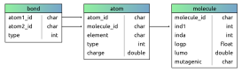
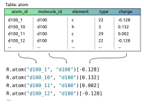
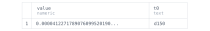
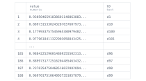
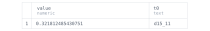

Deep Learning on Databases
==========================

Before running machine learning models written in some popular frameworks on data coming from relational databases, we
must first figure out how to transform the data properly. Commonly, all the models expect input data to be in the form of fixed-size
numeric tensors. Making such a transformation with a single database table (relation) might be straightforward. However,
that is not the case when our data are spread across variously linked and attributed relations, which is not very unusual.

So, is there a way to skip this preprocessing step and treat relational data more naturally and efficiently? In the NeuraLogic language, based on relational
logic, relations are *first-class citizens*. Everything is built around and upon them, enabling for *intuitive* and *direct* creation of models for
relational data, such as relational databases.

Since relational databases are an essential topic that most developers and engineers come in touch with on a daily
basis, the *PyNeuraLogic* framework is equipped with a set of tools to handle loading data from databases and exporting
your trained model to SQL so that you can evaluate your models directly in your databases!

Let's dive into an example where we explore ways of loading data from a relational database, training a model on data,
and exporting the trained model to SQL.

.. note::
    :class: empty-title, outline-only

    ⚗️ The last step - evaluation of trained models directly in the database (conversion to SQL) is currently an experimental feature;
    therefore, it comes with a few restrictions - models cannot contain recursive rules, matrices, and vectors.
    Also, only a limited set of transformation functions is implemented.

Data loading from database
**************************

.. note::
    :class: empty-title

    💾 `Download database tables SQL dump. <https://gist.github.com/LukasZahradnik/76b8b6b5e1d6f20752fdb8c61098b21b>`_

First things first, get to know the data we work with. Our example database contains information about molecules. Each
molecule has some attributes and is formed by a varying number of atoms. Atoms also have some attributes and can make
bonds (connections) with other atoms. Therefore, our database consists of three tables - *molecule*, *atom*, and *bond*.

    Database diagram of the molecule database we are working with

In this scenario, our task is to determine the mutagenicity of a molecule on Salmonella typhimurium. Our target is the
*mutagenic* field in the *molecule* table.

But how exactly can we transform those tabular data to *something* that PyNeuraLogic understands, that is,
relations? While there is a natural 1:1 mapping between tables and relations, we can also customize this a bit w.r.t. our needs.
For example, we might want to map each row of the *atom* table to the relation *R.atom* with *atom_id* and *molecule_id*
fields as the relations' *terms*, and the *charge* field as the relations' *values*.

    Mapping of one table to valued facts. We map *atom_id* and *molecule_id* columns to terms the *charge*
    column to fact value.

Notice that in the mapping visualization above, we skipped *element* and *type* fields. That is because we will
not utilize them in our model, but there is nothing stopping us from mapping all the fields to terms, or even mapping
one database table to multiple relations.

The mapping itself is quite straightforward; we create an instance of *DBSource* with *relation name*,
*table name*, and *column names* (that will be mapped to terms) as its arguments.
Here, we will utilize only data from *bond* and *atom* tables in our example set to keep it simple.

.. code-block:: python

    from neuralogic.dataset.db import DBSource, DBDataset

    atoms = DBSource("atom", "atom", ["atom_id", "molecule_id"], value_column="charge")
    bonds = DBSource("bond", "bond", ["atom1_id", "atom2_id", "type"], default_value=1)

To train our model, we also need labels. We can find them in the molecule table under the mutagenic field. But this
field contains textual data ("yes"/"no"), so we cannot just simply load the column as values (labels) of queries;
we have to do a little bit of postprocessing. For those scenarios, *DBSource* can take a *value_mapper* argument
that maps the original value from a table to some arbitrary numeric value.

.. code-block:: python

    queries = DBSource(
        "mutagenic",
        "molecule",
        ["molecule_id"],
        value_column="mutagenic",
        value_mapper=lambda value: 1 if value == "yes" else 0
    )

Since our task is to determine the mutagenicity, let's give our queries proper naming, i.e., *mutagenic*,
which is more self-explanatory (and can be more understandable to other team members). Let's now put everything together and
create a connection with some compatible driver (such as psycopg2 or MariaDB) to create a logical dataset.
With just those few lines of code, we have managed to create a relational dataset in the logic representation, populated from a database.

.. code-block:: python

    import psycopg2

    with psycopg2.connect(**connection_config) as connection:
        dataset = DBDataset(connection, [bonds, atoms], queries)
        logic_dataset = dataset.to_dataset()

Training on data from database
******************************

The dataset is ready; let's now take a look at defining the *template*, which roughly corresponds to creating a neural model architecture.
A template can be seen as a high-level blueprint for constructing a computation graph, which will be automatically tailored for each example and its target query.

The template we will define here calculates embeddings for each type of chemical bond (bond type is an integer in the range 1-7). Then we will
define four stacked *Message Passing Neural Networks* (*MPNNs*) where edges are bonds and nodes are chemical atoms. Our proposed
layers are similar to the *GraphSAGE* architecture except for the extra edge (*bond*) embeddings. Finally, the template
defines a readout layer (*mutagenic*) that pools embeddings of all nodes from all layers and aggregates them into one
value passed into a sigmoid function for the target molecule classification.

.. code-block:: python

    from neuralogic.core import Template, R, V, Transformation

    template = Template()
    template += [R.bond_embed(bond_type)[1,] for bond_type in range(1, 8)]

    template += R.layer1(V.A)[1,] <= (R.atom(V.N, V.M)[1,], R.bond_embed(V.B)[1,], R._bond(V.N, V.A, V.B))
    template += R.layer1(V.A)[1,] <= R.atom(V.A, V.M)[1,]

    template += R.layer2(V.A)[1,] <= (R.layer1(V.N)[1,], R.bond_embed(V.B)[1,], R._bond(V.N, V.A, V.B))
    template += R.layer2(V.A)[1,] <= R.layer1(V.A)[1,]

    template += R.layer3(V.A)[1,] <= (R.layer2(V.N)[1,], R.bond_embed(V.B)[1,], R._bond(V.N, V.A, V.B))
    template += R.layer3(V.A)[1,] <= R.layer2(V.A)[1,]

    template += R.layer4(V.A)[1,] <= (R.layer3(V.N)[1,], R.bond_embed(V.B)[1,], R._bond(V.N, V.A, V.B))
    template += R.layer4(V.A)[1,] <= R.layer3(V.A)[1,]

    template += R.mutagenic(V.M)[1,] <= (
        R.layer1(V.A)[1,], R.layer2(V.A)[1,], R.layer3(V.A)[1,], R.layer4(V.A)[1,], R.atom(V.A, V.M)[1,]
    )

    template += R.mutagenic / 1 | [Transformation.SIGMOID]

Now we can build our model by passing the template into an *evaluator*, which we then use to train the model on our dataset.

.. code-block:: python

    from neuralogic.nn import get_evaluator
    from neuralogic.core import Settings, Optimizer
    from neuralogic.nn.init import Glorot
    from neuralogic.nn.loss import CrossEntropy
    from neuralogic.optim import Adam

    settings = Settings(
        optimizer=Adam(), epochs=2000, initializer=Glorot(), error_function=CrossEntropy(with_logits=False)
    )

    neuralogic_evaluator = get_evaluator(template, settings)
    built_dataset = neuralogic_evaluator.build_dataset(logic_dataset)

    for epoch, (total_loss, seen_instances) in enumerate(neuralogic_evaluator.train(built_dataset)):
        print(f"Epoch {epoch}, total loss: {total_loss}, average loss {total_loss / seen_instances}")

Converting model to SQL
***********************

With just a few lines of code, the model that we just built from scratch and trained can be turned into (Postgres) SQL
code. By doing so, you can evaluate the model directly on your database server *without installing NeuraLogic* or even
Python. Just plain *PostgreSQL* will do!

All we have to do is to create a converter that takes our model, table mappings, and settings. Table mappings are similar
to *DBSource* described at the beginning of this article, which map relation names to table names and terms to
column names in the table.

.. code-block:: python

    from neuralogic.db import PostgresConverter, TableMapping

    convertor = PostgresConverter(
        neuralogic_evaluator.model,
        [
            TableMapping("_bond", "bond", ["atom1_id", "atom2_id", "type"]),
            TableMapping("atom", "atom", ["atom_id", "molecule_id"], value_column="charge")
        ],
        settings,
    )

Before you can evaluate your model in SQL, it is necessary to do a proper setup. We can achieve this by
installing the SQL code returned from the *get_std_functions* method. This SQL code will create two schemes (namespaces)
- *neuralogic_std* and *neuralogic*, and a minimal set of generic functions used in your model
(activations, aggregations, etc.) in the prior scheme (e.g., *neuralogic_std.sigmoid*).
The latter scheme will contain the functions for evaluating your model.

.. code-block:: python

    std_sql = convertor.get_std_functions()

After installing the first SQL code, you can install your actual model as SQL code that can be retrieved by calling the
*to_sql* method.

.. code-block:: python

    sql = convertor.to_sql()

.. note::
    :class: empty-title

    💾 `Download the full SQL dump (with std functions) of the trained model. <https://gist.github.com/LukasZahradnik/cb4535a272026f088d60b09e68bc03b3>`_

You are now set and ready to evaluate your trained model directly in the database without data ever leaving it.
For each fact and head of a rule, there is a corresponding function in the *neuralogic* namespace.
Let's say we would want to evaluate our model on a molecule with an id *"d150"*.
It is as simple as making one *Select* statement!

.. code-block:: sql

    SELECT * FROM neuralogic.mutagenic('d150');

|

The evaluation is not limited only to one molecule id. It is possible to use a *NULL* as a "placeholder"
(just like a variable in NeuraLogic) and retrieve all inferrable substitutions and their values.

.. code-block:: sql

    SELECT * FROM neuralogic.mutagenic(NULL);

|

As we already said before, every rule head has its corresponding function (if there is no table mapping attached).
This means we can even inspect values of different layers, for example, the value of atom *d15_11* in the first layer.

.. code-block:: sql

    SELECT * FROM neuralogic.layer1('d15_11');

|

Conclusion
**********
This short tutorial introduced and demonstrated PyNeuraLogic's support of deep learning for databases on a simple example
(learning with molecules). We went through how to fetch data from a database, transform them into PyNeuraLogic
relations with just a few lines of code, and train a model on those data. After training the model, we dumped it
into SQL code, which allowed us to evaluate the model directly in the database.
