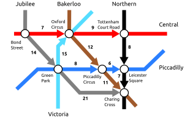

Fuzzy Relational Inference Engine
=================================

In the :ref:`inference-label` section, we introduced a high-level interface for the underlying inference engine that
does only minimal work to provide more performance (e.g., it does not construct neural networks).
To complement this type of inference engine, PyNeuraLogic also provides an evaluation inference engine that, on top of
finding all valid substitutions, runs an evaluation of the provided logic program.

Finding the Shortest Path
#########################

As an example of a possible use case of the evaluation inference engine, we will take a look at the example from :ref:`inference-label` but
with a slight twist - we introduce weights to connections, representing either distance from stations in time or some unit of length.

|

|

The encoding is almost the same, except for added values to each connection, that is :code:`connected(From, To, Line)[Distance]`.

.. code-block:: Python

    from neuralogic.core import Model, R, V, T, Metadata, Aggregation, Transformation, Combination

    template = Model()
    template += [
        R.connected(T.bond_street, T.oxford_circus, T.central)[7],
        R.connected(T.oxford_circus, T.tottenham_court_road, T.central)[9],
        R.connected(T.bond_street, T.green_park, T.jubilee)[14],
        R.connected(T.green_park, T.charing_cross, T.jubilee)[21],
        R.connected(T.green_park, T.piccadilly_circus, T.piccadilly)[8],
        R.connected(T.piccadilly_circus, T.leicester_square, T.piccadilly)[6],
        R.connected(T.green_park, T.oxford_circus, T.victoria)[15],
        R.connected(T.oxford_circus, T.piccadilly_circus, T.bakerloo)[12],
        R.connected(T.piccadilly_circus, T.charing_cross, T.bakerloo)[11],
        R.connected(T.tottenham_court_road, T.leicester_square, T.northern)[8],
        R.connected(T.leicester_square, T.charing_cross, T.northern)[7],
    ]

We have defined two rules called :code:`shortest_path`. The first rule aggregates connected stations and takes all connections' maximum value (distance).
The second rule handles instances when stations are not directly connected - at least one station has to be traversed
to get to the goal station. The second rule aggregates all possible instances and finds maximum value while "calling" one of the two rules recursively.

.. code-block:: Python

    metadata = Metadata(aggregation=Aggregation.MIN)

    template += (R.shortest(V.X, V.Y) <= R.connected(V.X, V.Y, V.L)) | metadata
    template += (R.shortest(V.X, V.Y) <= (R.connected(V.X, V.Z, V.L), R.shortest_path(V.Z, V.Y))) | metadata

.. attention::

    Notice we are appending metadata with an aggregation (Min) functions.

.. code-block:: Python

    template += R.shortest_path / 2 | Metadata(combination=Combination.MIN)

Evaluating Queries
******************

Now when the template and the knowledge base are ready, we can run queries the same way as for the previously introduced instance of the inference engine.
Since the model instance also provides the :code:`query` method (or :code:`q` for short), we can directly ask it for substitutions.

We can, for example, query the shortest path from the Bond Street station to the Charing Cross station.

.. code-block:: Python

    result = template.q(R.shortest_path(T.bond_street, T.charing_cross))

    print(result)

.. code-block::

    [
        {"X": "bond_street"}
    ]

To fully utilize the inference engine, we can also ask for substitutions from the Green Park station to all reachable stations.

.. code-block:: Python

    result = template.q(R.shortest_path(T.green_park, V.X))

    print(result)

.. code-block::

    [
        {"X": "charing_cross"},
        {"X": "leicester_square"},
        {"X": "piccadilly_circus"},
        {"X": "oxford_circus"},
        {"X": "tottenham_court_road"}
    ]

This output then tells us the shortest path to the Charing Cross station from the Green Park station is reachable, to the Leicester Square station is reachable, and so on.
