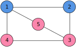

Heterogeneous Graphs
====================

Most GNN models consider graphs to be homogeneous - that is, all nodes being of one type, despite many possible
instances of problems, where it would be beneficial to utilize information about entities' types and their relations'
types. In PyNeuraLogic, we can easily encode instances of such heterogeneous graphs with an arbitrary number of nodes'
and edges' classes out of the box.

|

Let's consider the graph in the above figure, where nodes' color represents their type (either *Blue* or *Pink*).
We can represent introduced nodes' types in the input examples, for example, as the following list of ground relations:

.. code-block:: Python

    Relation.type(1, Term.BLUE),
    Relation.type(2, Term.BLUE),
    Relation.type(3, Term.PINK),
    Relation.type(4, Term.PINK),
    Relation.type(5, Term.PINK),

.. NOTE::

    Note that there are many ways to express the same concept. We could, for example, encode types (for nodes 1 and 3)
    as :code:`Relation.blue(1), Relation.pink(3)`.  Nodes are also not limited to have only one type; we can assign multiple
    types to one node, such as :code:`Relation.type(1, Term.BLUE), Relation.type(1, Term.PINK)`.

.. NOTE::

    In this example, we consider only nodes' types, but we can analogically encode edges' (or any other) types.

We can then utilize the information about types for various use cases. In the following example, we showcase a template
rule for the aggregation of neighbor nodes of the central node with the same type as the central node.

.. code-block:: Python

    Relation.h(Var.X) <= (
        Relation.feature(Var.Y),
        Relation.type(Var.X, Var.Type),
        Relation.type(Var.Y, Var.Type),
        Relation.edge(Var.Y, Var.X),
    )

Since types are just regular constructs (relations) in PyNeuraLogic, we are able to manipulate them as anything else.
We can, for example, create hierarchies of types or, as is shown in the following example, attach features to types in
input examples and then utilize them in the aggregation.

.. code-block:: Python

    Relation.type_feature(Term.BLUE)[[1, 2, 3]]

.. code-block:: Python

    Relation.h(Var.X) <= (
        Relation.feature(Var.Y),
        Relation.type_feature(Var.Type),
        Relation.type(Var.Y, Var.Type),
        Relation.edge(Var.Y, Var.X),
    )
