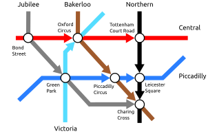

.. _inference-label:

Utilizing Inference Engine
==========================

While translating logic programs into computations graphs, PyNeuraLogic utilizes an `inference engine <https://en.wikipedia.org/wiki/Inference_engine>`_.
The inference engine serves for deducing information from the input knowledge base encoded in examples or a template.
For convenience, this functionality is also exposed via a high-level interface to be accessible for users.

London Underground Example
##########################

The interface for the inference engine is relatively simple. Consider the following example based on `the "Simply Logical: Intelligent Reasoning by Example" book <https://book.simply-logical.space/>`_ by Peter Flach.
We have a network based on a part of the London Underground encoded as a directed graph as visualized in the following image.

|

|

This graph can be encoded as :code:`connected(From, To, Line)` such as:

.. code-block:: Python

    from neuralogic.core import Template, R, V, C

    template = Template()
    template += [
        R.connected(C.bond_street, C.oxford_circus, C.central),
        R.connected(C.oxford_circus, C.tottenham_court_road, C.central),
        R.connected(C.bond_street, C.green_park, C.jubilee),
        R.connected(C.green_park, C.charing_cross, C.jubilee),
        R.connected(C.green_park, C.piccadilly_circus, C.piccadilly),
        R.connected(C.piccadilly_circus, C.leicester_square, C.piccadilly),
        R.connected(C.green_park, C.oxford_circus, C.victoria),
        R.connected(C.oxford_circus, C.piccadilly_circus, C.bakerloo),
        R.connected(C.piccadilly_circus, C.charing_cross, C.bakerloo),
        R.connected(C.tottenham_court_road, C.leicester_square, C.northern),
        R.connected(C.leicester_square, C.charing_cross, C.northern),
    ]

This template essentially encodes only direct connections between stations (nodes).
We might want to extend this knowledge by deducing which stations are nearby - stations with at most one station between them.

So stations are nearby if they are directly connected, which can be expressed as:

.. code-block:: Python

    template += R.nearby(V.X, V.Y) <= R.connected(V.X, V.Y, V.L)

Stations are also nearby if exactly one station lays on the path between those two stations and are on the same line.

.. code-block:: Python

    template += R.nearby(V.X, V.Y) <= (R.connected(V.X, V.Z, V.L), R.connected(V.Z, V.Y, V.L))

Now we can ask the inference engine to get all sorts of different information, such as what stations are nearby the Tottenham Court Road station.

.. code-block:: Python

    from neuralogic.inference.inference_engine import InferenceEngine

    engine = InferenceEngine(template)

    engine.q(R.nearby(C.tottenham_court_road, V.X))

Running the :code:`query` (or :code:`q`) will return a generator of dictionaries with all possible substitutions for all variables in the query.
In this case, we have only one variable in the query (:code:`V.X`). As you can see, the inference engine found all stations that are nearby the Tottenham Court Road station (Leicester Square and Charing Cross).

.. code-block::

    [
        {"X": "leicester_square"},
        {"X": "charing_cross"},
    ]

We could also ask the inference engine to get all possible nearby stations (:code:`R.nearby(V.X, V.Y)`) and so on.

Finding Path Recursively
************************

We can also define another rule to check a generic path from a station :code:`X` to another station :code:`Y`.
We will call this rule :code:`reachable` and use recursion in its definition. The :code:`reachable` rule is satisfied if two stations are directly connected or station :code:`X` is connected to station :code:`Z` from which you can reach :code:`Y`.

.. code-block:: Python

    template += R.reachable(V.X, V.Y) <= R.connected(V.X, V.Y, V.L)
    template += R.reachable(V.X, V.Y) <= (R.connected(V.X, V.Z, V.L), R.reachable(V.Z, V.Y))

Now we can ask the inference engine what stations we can reach from a station or ask more exact queries such as if two specific stations are reachable.

.. code-block:: Python

    engine = InferenceEngine(template)

    if engine.query(R.reachable(C.green_park, C.tottenham_court_road)):
        print("Yes, you can reach Tottenham Court Road from Green Park")
    else:
        print("Those two stations are reachable, so this should never be printed out")

Changing the Knowledge Base
***************************

There might be cases where we want to reuse defined rules on the different knowledge bases (e.g., on different cities' underground systems) or extend the knowledge base for some queries (e.g., add additional routes).

We can extend the current knowledge defined in the template using the :code:`set_knowledge` method.

.. code-block:: Python

    engine.set_knowledge(additional_knowledge)

We can also set a knowledge that will extend the knowledge base defined in the template but will ignore the knowledge set by the :code:`set_knowledge` method.
This knowledge base will be considered only for the context of the query.

.. code-block:: Python

    engine.query(R.some_query, additional_knowledge)
