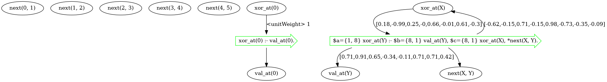
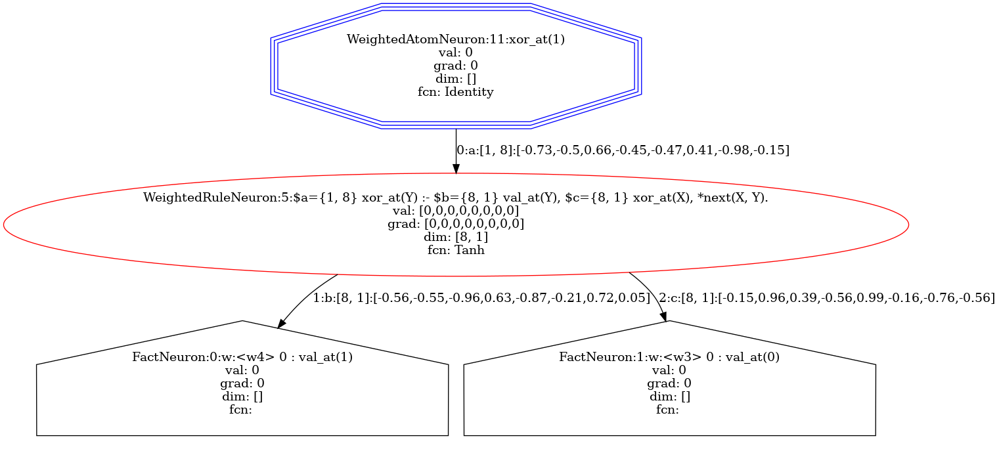
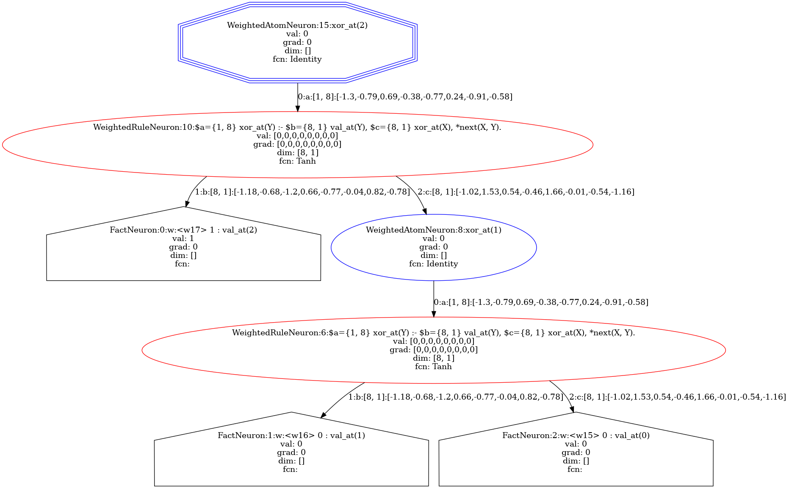
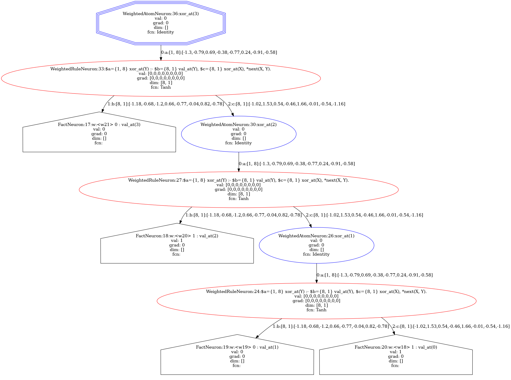

Recursive XOR Generalization
============================

.. admonition:: \ \
    :class: empty-title

    You can run this page in `Jupyter Notebook <https://github.com/LukasZahradnik/PyNeuraLogic/blob/master/examples/RecursiveXORGeneralization.ipynb>`_ |thiscolab|

.. |thiscolab| image:: https://colab.research.google.com/assets/colab-badge.svg
                :alt: Open in Colab
                :target: https://colab.research.google.com/github/LukasZahradnik/PyNeuraLogic/blob/master/examples/RecursiveXORGeneralization.ipynb

In one of our `introductory examples <https://github.com/LukasZahradnik/PyNeuraLogic/blob/master/examples/IntroductionIntoPyNeuraLogic.ipynb>`_
we have showcased how to learn the XOR operation for two inputs. In this example, we will generalize the learning of
the XOR operation to *N* inputs while making the use of recursion.

We will define a recursive template, train it on the classic XOR (two inputs) and show an inference of inputs of different lengths.

The template will essentially evaluate :math:`xor_n = xor(val_n, xor_{n-1})` with shared weights across all depths.

.. code-block:: python

    from neuralogic.nn import get_evaluator
    from neuralogic.core import Settings, R, V, Template, Transformation
    from neuralogic.dataset import Dataset

Before we define rules for the actual learning, we introduce helper relations (facts) ``R._next``.
Those rules serve for the definition of the sequence of integers, that is :math:`1, 2, ..., N`
(:math:`N` is defined by ``max_number_of_vars``). We have to do that because later on, we will utilize this sequence for
the recursion. Integers in PyNeuraLogic are independent entities with no extra meaning or context.

.. code-block:: python

    max_number_of_vars = 5

    template = Template()
    template += (R._next(i, i + 1) for i in range(max_number_of_vars))

We then define the base case of the recursion, that is, to get the value of :math:`xor` of length :math:`1` (index :math:`0`)
return the value of the first (index :math:`0`) element.

.. code-block:: python

    template += R.xor_at(0) <= R.val_at(0)

Now when we have the base case ready, we introduce the recursive "calls". The following rule can be interpreted as
"To calculate the :math:`xor` of length :math:`N` (``V.Y``), calculate the xor of length :math:`N - 1` (``V.X``)
and pipe the result together with the element at index :math:`N` (``R.val_at(V.Y)``) into :math:`xor`".

We also assigned three unique vector learnable parameters and named them. Naming is entirely optional and is here only to show the mapping later.

.. code-block:: python

    template += R.xor_at(V.Y)["a": 1, 8] <= (R.val_at(V.Y)["b": 8, 1], R.xor_at(V.X)["c": 8, 1], R._next(V.X, V.Y))

And that is everything you need to define a template for recursive generalization of XOR!

The recursion, together with weights mapping, can be viewed in the template graph by drawing it.

.. code-block:: python

    template.draw()

The definition of the training data set is straightforward; we train the model on inputs of the length of two.
That is, we encode :math:`xor(0, 0) = 0`, :math:`xor(1, 0) = 1`, and so on as the training set.

.. code-block:: python

    examples = [
        [R.val_at(0)[0], R.val_at(1)[0]],  # input: 0, 0
        [R.val_at(0)[0], R.val_at(1)[1]],  # input: 0, 1
        [R.val_at(0)[1], R.val_at(1)[0]],  # input: 1, 0
        [R.val_at(0)[1], R.val_at(1)[1]],  # input: 1, 1
    ]

    queries = [  # outputs: 0, 1, 1, and 0
        R.xor_at(1)[0], R.xor_at(1)[1], R.xor_at(1)[1], R.xor_at(1)[0],
    ]

    train_dataset = Dataset(examples, queries)

.. code-block:: python

    settings = Settings(
        epochs=5000,
        rule_transformation=Transformation.TANH,
        relation_transformation=Transformation.IDENTITY,
        iso_value_compression=False,
    )

    evaluator = get_evaluator(template, settings)
    built_dataset = evaluator.build_dataset(train_dataset)

.. note::

    Notice we turned off compression, so the recursion is clearly visible in the visual representation later on.

Once we build the training dataset, we can visualize each sample. For example, the :math:`xor(0, 0)` sample will be represented by the following computation graph.

.. code-block:: python

    built_dataset.samples[0].draw()

.. code-block:: python

    evaluator.train(built_dataset, generator=False)

We train the model on the training dataset via the evaluator and then prepare a test dataset.
We can put any input of maximum length of *N* (``max_number_of_vars``) into the dataset. For this example, we chose
:math:`xor(0, 0, 1)` and :math:`xor(1, 0, 1, 0)`. Feel free to try out other lengths and combinations!

.. code-block:: python

    test_examples = [
        [R.val_at(0)[0], R.val_at(1)[0], R.val_at(2)[1]],
        [R.val_at(0)[1], R.val_at(1)[0], R.val_at(2)[1], R.val_at(3)[0]],
    ]

    test_queries = [
        R.xor_at(2), R.xor_at(3)
    ]

    test_dataset = Dataset(test_examples, test_queries)
    built_test_dataset = evaluator.build_dataset(test_dataset)

When we visualize our test samples and compare them, we can clearly see how the template is recursively unrolled into
computation graphs (trees) with shared weights across depths.

.. code-block:: python

    built_test_dataset.samples[0].draw()

.. code-block:: python

    built_test_dataset.samples[1].draw()

Running inference on our test dataset yields correct results, that is :math:`xor(0, 0, 1) = 1` and :math:`xor(1, 0, 1, 0) = 0`.

.. code-block:: python

    for _, result in evaluator.test(built_test_dataset):
        print(result)  # 1, 0
