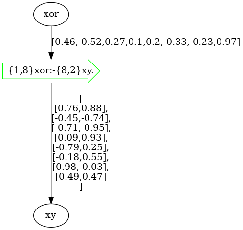
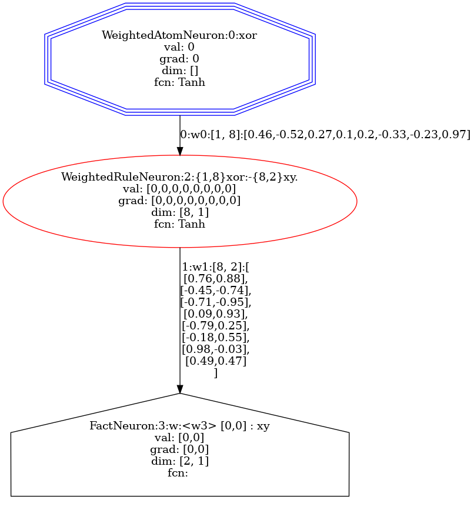

Visualization
=============

.. admonition:: \ \
    :class: empty-title

    You can run this page in `Jupyter Notebook <https://github.com/LukasZahradnik/PyNeuraLogic/blob/master/examples/Visualization.ipynb>`_ |thiscolab|

.. |thiscolab| image:: https://colab.research.google.com/assets/colab-badge.svg
                :alt: Open in Colab
                :target: https://colab.research.google.com/github/LukasZahradnik/PyNeuraLogic/blob/master/examples/Visualization.ipynb

PyNeuraLogic offers multiple options for visualization of templates and samples, which can be helpful while investigating
how the high-level rule representations are being translated into computation graphs. The usage of visualization tools
requires having installed `Graphviz <https://graphviz.org/download/>`_.

Depending on the parametrization, the drawing methods can output either graph image in bytes, graph image rendered into
a file, or graph image displayed into IPython (Jupyter Notebook).

Additionally, it is also possible to retrieve the generated source of graphs in the DOT format. This format can then be
used to display or further customize and manipulate generated graphs in other libraries.

Visualization of the XOR Example
################################

To showcase the usage of visualization tools, we will use the template and the dataset introduced
in `XOR Example <https://github.com/LukasZahradnik/PyNeuraLogic/blob/master/examples/IntroductionIntoPyNeuraLogic.ipynb>`_ |colab|

.. |colab| image:: https://colab.research.google.com/assets/colab-badge.svg
                :alt: Open in Colab
                :target: https://colab.research.google.com/github/LukasZahradnik/PyNeuraLogic/blob/master/examples/IntroductionIntoPyNeuraLogic.ipynb

Model Rendering
***************

All that is needed to visualize the model - the template with current weights' values is to call the :code:`draw` method.

.. code-block:: Python

    from neuralogic.utils.data import XOR_Vectorized
    from neuralogic.core import Settings

    template, dataset = XOR_Vectorized()
    model = template.build(Settings())

    model.draw()

|

.. tip::

    If you are using evaluators, you can draw the model via the :code:`evaluator.draw` method.

.. tip::

    You can also visualize the template by calling the :code:`template.draw` method.

Templates (models) and samples can be drawn into various raster formats (such as PNG or JPEG) or SVG format, which is
considerably faster for larger graphs. To set the format, simply use the :code:`img_type` parameter.

The drawing can be further parameterized, for example, with the :code:`value_detail` parameter to display more (or less) decimal
places of all values (there are three levels of detail - :code:`0-2`, where :code:`0` has the least number of decimals
and :code:`2` the most number of decimals).

The model above was directly drawn into Jupyter Notebook without any parametrization.
To draw the model into a file, all we have to do is add the :code:`filename` parameter with a path to the output image, such as:

.. code-block:: Python

    model.draw(filename="my_image.png")

We can also get raw images bytes by turning off displaying into IPython:

.. code-block:: Python

    model.draw(show=False)

.. tip::
    If you are drawing straight into Jupyter Notebook, you can include additional parameters into drawing functions
    to customize the underlying `Image <https://ipython.readthedocs.io/en/stable/api/generated/IPython.display.html#IPython.display.Image>`_ and `SVG <https://ipython.readthedocs.io/en/stable/api/generated/IPython.display.html#IPython.display.Image>`_ objects.

Samples Rendering
*****************

Samples can be drawn in the same way and supports the same parametrization as the model drawing.

An example of drawing samples can be seen in the code below, where we render the actual computation graph for the first example (input :code:`[0, 0]`).

.. code-block:: Python

    built_dataset = model.build_dataset(dataset)

    built_dataset.samples[0].draw()

|

Getting the DOT Source
**********************

To get the DOT source of the model or the sample, all you have to do is call the :code:`model_to_dot_source` function or
the :code:`sample_to_dot_source` function, respectively.

.. code-block:: Python

    from neuralogic.utils.visualize import sample_to_dot_source

    dot_source = sample_to_dot_source(built_dataset.samples[0])
    print(dot_source)

.. code-block:: dot

    digraph G {
    3 [shape=house, color=black, label="FactNeuron:3:w:<w3> [0,0] : xy
    val: [0,0]
    grad: [0,0]
    dim: [2, 1]
    fcn:
    "]

    2 [shape=ellipse, color=red, label="WeightedRuleNeuron:2:{1,8}xor:-{8,2}xy.
    val: [0,0,0,0,0,0,0,0]
    grad: [0,0,0,0,0,0,0,0]
    dim: [8, 1]
    fcn: Tanh
    "]
    2 -> 3 [label="1:w1:[8, 2]:[
    [0.76,0.88],
    [-0.45,-0.74],
    [-0.71,-0.95],
    [0.09,0.93],
    [-0.79,0.25],
    [-0.18,0.55],
    [0.98,-0.03],
    [0.49,0.47]
    ]"]

    0 [shape=ellipse, color=blue, label="WeightedAtomNeuron:0:xor
    val: 0
    grad: 0
    dim: []
    fcn: Tanh
    "]
    0 -> 2 [label="0:w0:[1, 8]:[0.46,-0.52,0.27,0.1,0.2,-0.33,-0.23,0.97]"]

    0 [shape = tripleoctagon]
    }
