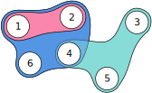

Hypergraph Neural Networks
==========================

A hypergraph is a generalization of a simple graph :math:`G = (V, E)`, where :math:`V` is a set of vertices
and :math:`E` is a set of edges (hyperedges) connecting an arbitrary number of vertices.

Representation of hyperedges
############################

When we encode input data (graph) in the form of logic data format (i.e., ground relations),
we can represent regular edges, for example, as :code:`Relation.edge(1, 2)`.

|

This form of representation can be simply extended to express hyperedges by adding terms for each connected
vertex by the hyperedge. For example, graph :math:`G = (V, E)`, where :math:`V = \{1, 2, 3, 4, 5, 6\}`
and :math:`E = \{\{1, 2\}, \{3, 4, 5\}, \{1, 2, 4, 6\}\}` can be represented as:

.. code-block::

    Relation.edge(1, 2),
    Relation.edge(3, 4, 5),
    Relation.edge(1, 2, 4, 6),

Propagation on hyperedges
#########################

The propagation through standard edges can be similarly extended to support propagation through hyperedges.

.. code-block::

    Relation.h(Var.X) <= (Relation.feature(Var.Y), Relation.edge(Var.Y, Var.X))

The propagation through standard edges above, where :code:`Relation.feature` might represent vertex features,
and :code:`Relation.edge` represents an edge, might be extended to support hyperedges (for hyperedge connecting three
vertices) as follows:

.. code-block::

    Relation.h(Var.X) <= (
        Relation.feature(Var.Y),
        Relation.feature(Var.Z),
        Relation.edge(Var.Y, Var.Z, Var.X),
    )
