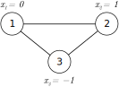

🚀 Quick Start
==============

The PyNeuraLogic library serves for learning on structured data. This quick start guide will showcase one of its uses on
graph structures. Nevertheless, the library is directly applicable to more complex structures, such as relational databases.

.. Tip::
    Check out one of the runnable :ref:`examples-label` in Google Colab!

Graph Representation
####################

Graphs are structures describing entities (vertices) and relations (edges) between them.
In this guide, we will look into how to encode graphs as inputs in different formats and how to learn on graphs.

Tensor Representation
*********************

In PyNeuraLogic, you can encode input graphs in various formats depending on your preferences. One such format is a tensor format that you might
already know from other GNN-focused frameworks and libraries. The input graph is
represented in a graph connectivity format, i.e., tensor of shape :code:`[2, num_of_edges]`. The features are encoded
via tensor of shape :code:`[num_of_nodes, num_of_features]`.

|

Let's consider a simple undirected graph shown above. We can simply encode the structure of the graph (edges) via the
:code:`edge_index` property and nodes' features via the :code:`x` property of class :py:class:`~neuralogic.dataset.tensor.Data`, which encapsulates graphs' data. We can also assign a label to each node via
the :code:`y` property.
The :py:class:`~neuralogic.dataset.tensor.TensorDataset` instance then holds a list of such graphs tensor representations
(:py:class:`~neuralogic.dataset.tensor.Data` instances) and can be fed into models

.. code-block:: python

    from neuralogic.dataset import Data, TensorDataset

    data = Data(
        edge_index=[
            [0, 1, 1, 2, 2, 0],
            [1, 0, 2, 1, 0, 2],
        ],
        x=[[0], [1], [-1]],
        y=[[1], [0], [1]],
        y_mask=[0, 1, 2],
    )

    dataset = TensorDataset(data=[data])

Logic Representation
********************

The tensor representation works well for elementary use cases, but it can be quite limiting for more complex inputs.
Not everything can be easily aligned and fitted into a few tensors,
and working with tensors can get quickly cumbersome. That's where the logic representation comes in with its high expressiveness.

The logic format is based on relational logic constructs to encode the input data, such as graphs. Those constructs are
mainly so-called facts, which are represented in PyNeuraLogic as :code:`Relation.predicate_name(...terms)[value]`.

The :py:class:`~neuralogic.dataset.logic.Dataset` class contains a set of fact lists representing input graphs. The encoding of the previously shown simple graph can look like the following:

.. code-block:: Python

    from neuralogic.core import Relation
    from neuralogic.dataset import Dataset

    dataset = Dataset()

    dataset.add_example([
        Relation.edge(0, 1), Relation.edge(1, 2), Relation.edge(2, 0),
        Relation.edge(1, 0), Relation.edge(2, 1), Relation.edge(0, 2),

        Relation.node_feature(0)[0],
        Relation.node_feature(1)[1],
        Relation.node_feature(2)[-1],
    ])

As you can see, this encoding can be pretty lengthy, but at the same time, it gives us multiple benefits over the tensor
representation. For example, nothing stops you from adding edge features, such as :code:`Relation.edge(0, 1)[1.0]`,
or even introducing hypergraphs, such as :code:`Relation.edge(0, 1, 2)` (read more about :doc:`beyond/hypergraphs`).

.. NOTE::
    We used the *edge* as the predicate name (:code:`Relation.edge`) to represent the graph edges and the *feature* (:code:`Relation.node_feature`) to represent nodes' features. This naming is arbitrary -
    edges and any other input data can have any predicate name. In this documentation, we will stick to *edge* predicate name for
    representing edges and *feature* predicate name for representing features.

To assign labels, we use queries. Labels can be assigned to basically anything - nodes, graphs, sub-graphs, etc.
In this example, we will label nodes, just like in the case of tensor format representation.

.. code-block:: Python

    dataset.add_queries([
        Relation.predict(0)[1],
        Relation.predict(1)[0],
        Relation.predict(2)[1],
    ])

.. NOTE::

    The name :code:`Relation.predict` refers to the output layer of our model, which we will define in the next section.

Model Definition
################

Models in PyNeuraLogic are not just particular computational graphs, as common in classic deep learning, but can be viewed more generally as *templates* for (differentiable) computation.
The template structure is encoded in the instance of the :py:class:`~neuralogic.core.template.Template` class via relational *rules* or, for convenience, pre-defined modules (which are also expanded into said rules, check out the :doc:`zoo` for a list of modules).

.. code-block:: python

    from neuralogic.core import Template, Settings
    from neuralogic.nn.module import GCNConv

    template = Template()
    template.add_module(
        GCNConv(in_channels=1, out_channels=5, output_name="h0", feature_name="node_feature", edge_name="edge")
    )
    template.add_module(
        GCNConv(in_channels=5, out_channels=1, output_name="predict", feature_name="h0", edge_name="edge")
    )

Here we defined two :py:class:`~neuralogic.nn.module.gcn.GCNConv` layers via pre-defined modules.
We further discuss template definition via the rule format, which forms the core advantage of this framework, in the section of the documentation.

Evaluating Model
################

Now when we have our template defined, we have to get (build) the model from the template to be able to run training and inference on it.
We do that by calling the :code:`build` method.

.. code-block:: Python

    from neuralogic.core import Settings
    from neuralogic.optim import SGD

    settings = Settings(optimizer=SGD(lr=0.01), epochs=100)
    model = template.build(Settings())

The input dataset that we are trying to evaluate/train has to be also built. When we have the built dataset and model,
performing the forward and backward propagation is straightforward.

.. code-block:: Python

    built_dataset = model.build_dataset(dataset)

    model.train()  # or model.test() to change the mode
    output = model(built_dataset)

Evaluators
**********

For faster prototyping, we have prepared *evaluators* which encapsulate helpers, such as training loop and
evaluation. Evaluators can then be customized via various settings wrapped in the :py:class:`~neuralogic.core.settings.Settings` class.

.. code-block:: Python

    from neuralogic.nn import get_evaluator
    from neuralogic.core import Settings
    from neuralogic.optim import SGD

    settings = Settings(optimizer=SGD(lr=0.01), epochs=100)
    evaluator = get_evaluator(template, settings)

    built_dataset = evaluator.build_dataset(dataset)
    evaluator.train(built_dataset, generator=False)
