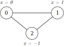

Quick Start
===========

The PyNeuraLogic library serves for learning on structured data. For the purpose of the introduction to the library and
its syntax, we will further discuss use cases on graph structures.

Graph Representation
####################

Graphs can describe entities (vertices) and their relations (edges) which can be useful for various tasks. Graphs are
used as inputs for models and are contained in the :py:class:`~neuralogic.utils.data.dataset.Dataset` class.

The :py:class:`~neuralogic.utils.data.dataset.Dataset` class containing information about graphs can be used in different ways depending on the data format. The
next section will showcase how to represent the following graph (triangle) in two formats - tensor and logic.

|

Tensor Representation
*********************

The tensor format is a familiar format used in many other GNN focused frameworks and libraries. The input graph is
represented in a graph connectivity format, i.e., tensor of shape :code:`[num_of_edges, 2]`. The features are encoded via tensor of shape :code:`[num_of_nodes, num_of_features]`.

.. code-block:: Python

    from neuralogic.utils.data.dataset import Dataset
    from neuralogic.utils.data.dataset import Data

    data = Data(
        edge_index=[[1, 2], [2, 1], [1, 3], [3, 1], [2, 3], [3, 2]],
        x=[[0], [1], [-1]],
    )

    dataset = Dataset(data=[data])

In this example, we are encoding the simple graph (triangle) in the tensor format. The structure of the graph is
encoded in :code:`edge_index` property of the Data class instance. Each :py:class:`~neuralogic.utils.data.dataset.Data` class instance holds information about exactly
one graph. The :py:class:`~neuralogic.utils.data.dataset.Dataset` instance then holds a list of data instances and serves as the input.

.. NOTE::

    We omitted a few :py:class:`~neuralogic.utils.data.dataset.Data` class attributes, such as :code:`edge_attr` for the edges'
    features encoding, and :code:`y` and :code:`y_mask` for the target labels encoding.

The tensor representation offers less verbose graph representation but it is more limited in its expressiveness than the logic
format introduced in the next section.

Logic Representation
********************

The logic format utilizes constructs based on relational logic to encode input data - graphs. The input data are represented in the form of ground atoms (facts),
which can be expressed as :code:`Relation.predicate_name(terms)[value]`.

.. code-block:: Python

    from neuralogic.utils.data.dataset import Dataset
    from neuralogic.core import Relation

    dataset = Dataset()

    dataset.add_example([
        Relation.edge(1, 2), Relation.edge(2, 1), Relation.edge(1, 3),
        Relation.edge(3, 1), Relation.edge(2, 3), Relation.edge(3, 2),

        Relation.feature(1)[0],
        Relation.feature(2)[1],
        Relation.feature(3)[-1],
    ])

In this example, we represent the same simple graph (triangle) but in the logic format.

.. NOTE::
    We used the *edge* as the predicate name (:code:`Relation.edge`) to represent the graph edges and the *feature* (:code:`Relation.feature`) to represent nodes' features. This naming is arbitrary -
    edges and any other input data can have any predicate name. In this documentation, we will stick to *edge* predicate name for
    representing edges and *feature* predicate name for representing features.

.. NOTE::
    In the example, we encode the graph structure (and its features) using an *example* (:py:meth:`~neuralogic.utils.data.dataset.Dataset.add_example`), which does not handle target
    labels - those are handled by *queries* (:py:meth:`~neuralogic.utils.data.dataset.Dataset.add_query`).

Model Definition
################

The model architecture is encoded in the instance of the :py:class:`~neuralogic.core.template.Template` class via rules or a list of predefined modules
(i.e. a :py:class:`~neuralogic.utils.templates.TemplateList` instance populated with modules, for example, with :py:class:`~neuralogic.utils.templates.modules.gcn.GCNConv`)

.. code-block:: Python

    from neuralogic.core import Template
    from neuralogic.utils.templates import GCNConv, TemplateList

    template = Template(module_list=TemplateList([
        GCNConv(in_channels=5, out_channels=5),
        GCNConv(in_channels=5, out_channels=1),
    ]))

Evaluating Model
################

The PyNeuraLogic library allows users to evaluate and train models on different backends. Those backends
(except for the Java backend) have to be installed separately. To get a model that can be evaluated/trained,
you have to build its template first.

.. code-block:: Python

    from neuralogic.core import Backend

    model = template.build(Backend.JAVA)

The input dataset that we are trying to evaluate/train has to be also built. When we have the built dataset and model,
performing the forward and backward propagation is straightforward.

.. code-block:: Python

    built_dataset = template.build_dataset(dataset, Backend.JAVA)

    model.train()  # or model.test() to change the mode
    loss = model(built_dataset)

    loss.backward()

Evaluators
**********

For faster prototyping, we have prepared evaluators, which encapsulate helpers such as training loop and
evaluation. Evaluators can be customized via various settings encapsulated in the :py:class:`~neuralogic.core.settings.Settings` class.

.. code-block:: Python

    from neuralogic.nn import get_evaluator
    from neuralogic.core import Settings, Optimizer

    settings = Settings(learning_rate=0.01, optimizer=Optimizer.SGD, epochs=100)
    evaluator = get_evaluator(template, Backend.JAVA, settings)

    evaluator.train(dataset, generator=False)

.. NOTE::
    In the example for the evaluator, we pass the :py:class:`~neuralogic.utils.data.dataset.Dataset` instance (not built dataset) to the :code:`train` method.
    The evaluator handles the building, but it can be more efficient to pass in an already built dataset
    (evaluator does not store built dataset instances).
