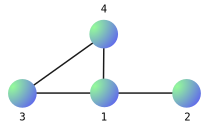
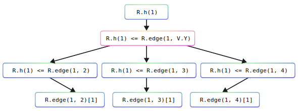
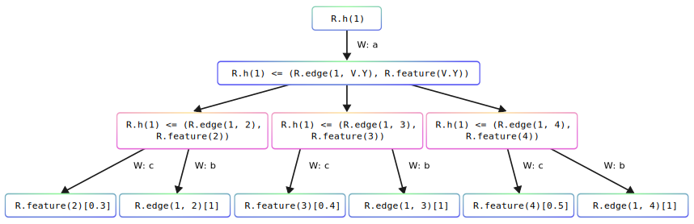
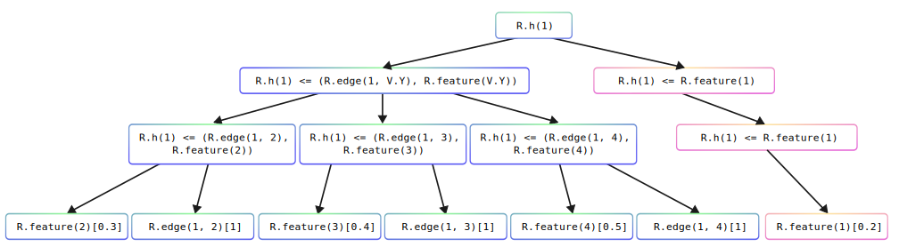
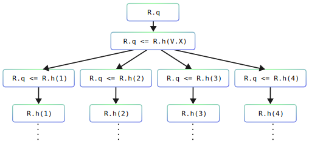

Understanding Rules
===================

In PyNeuraLogic, describing a learning model differs from conventional deep learning frameworks.
Here, instead of putting together a sequence of modules and operations on numeric tensors, we define a model "template" formed from `rules` operating on `relations`.
This template is then used to unfold differentiable computational graphs, which may be tailored for each (relational) learning sample.

`But how exactly do these rules translate into computational graphs?`

The semantics of this process follows directly from logical inference, and is described in detail in the paper(s) on `Lifted Relational Neural Networks <https://arxiv.org/abs/2007.06286>`_
However, let us skip the scientific notions here and take a direct look at the process through a simple example instead!

Consider the following relatively simple graph with arbitrarily picked node ids. Usually, we would encode the graph either as
an adjacency matrix, or simply a list of edges with two vectors - :code:`[[sources], [destinations]]`.
The latter representation for graphs is also available in PyNeuraLogic for convenience, but we will stick with the more general relational representation here, and describe the graph edges as :code:`R.edge(<source>, <destination>)`, that is:

.. code-block:: Python

    [
        R.edge(3, 1), R.edge(2, 1), R.edge(4, 3), R.edge(4, 1),
        R.edge(1, 3), R.edge(1, 2), R.edge(3, 4), R.edge(1, 4),
    ]

And just like that, we encoded our example input graph with bidirectional edges. Let us now define few example templates to operate upon this graph, and dive into how they are being compiled into `computational` graphs.

An Entry Template
******************

.. code-block:: Python

    R.h(V.X) <= R.edge(V.X, V.Y)

The first template is relatively simple; it contains one rule with only one body relation :code:`R.edge(V.X, V.Y)`.
The rule roughly translates into plain English as

    "To compute representation :code:`h` of any entity :code:`X`, aggregate all values of relations :code:`R.edge` where the entity :code:`X` is the `"source" node` of the relation edge."

So, for example, for a query :code:`R.h(1)`, there are exactly three instances of the edge relation that satisfy the template rule -
:code:`R.edge(1, 2)`, :code:`R.edge(1, 3)`, and :code:`R.edge(1, 4)`, corresponding to the three neighbors of the node 1. So in the end, we end up with a computational graph like the one below.
The computation in the graph goes from the bottom (input) level up to the output level, which corresponds to our query.

.. note::

    Notice that the input value of all the edge relations is :code:`1`. This value has been set implicitly because we didn't provide any.

This visualization renders only the graph's `structure` without specification of the operations on the values being passed through. However, every node in this graph can be associated with some function.

In this case, let us focus on the only node with multiple inputs, highlighted with the magenta color. This node is the so-called `aggregation` node that aggregates all of its inputs through some aggregation function (`AVG` by default) to produce a single output value.

.. code-block::

    value = AVG (value(...edge(1,2)), value(...edge(1,3)), value(...edge(1,4)))

..
    With that knowledge, it is now hopefully clearer that this computational graph actually corresponds to what we expressed in "plain English" above.

Note how this functionality can be viewed as a basis for the "neighborhood aggregation" operation commonly utilized in Graph Neural Networks.

.. note::

    What if we have a node without any edge and want to compute the :code:`R.h`? We will get an exception because we cannot satisfy the rule. Later in this tutorial, we will look at solutions to such a scenario.

Multiple Body Relations
***********************

Our first template was very limited in what we were able to express.
We will often find ourselves declaring rules with multiple body relations to capture more complicated computational patterns.
As an example of such a template rule, we could introduce a `feature` relation for the nodes and utilize it in the rule.
Also, we will introduce weights to the rule at the same time.

.. code-block::

    R.h(V.X)["a": 1,] <= (R.edge(V.X, V.Y)["b": 1,], R.feature(V.Y)["c": 1,])

.. note::

    We used named weights here to clarify how the weights are being mapped into the computational graph. However you can normally omit these names.

Now, let us extend our input data (the encoding of the input graph) with some node features correspondingly. For simplicity, each feature will be a simple scalar value, for example:

.. code-block::

    R.feature(1)[0.2], R.feature(2)[0.3], R.feature(3)[0.4], R.feature(4)[0.5]

Now, for the same query :code:`R.h(1)`, we will end up with the computational graph below.
Note how the bottom layer expanded with additional inputs (:code:`R.feature`), and how the weights came upe associated with the corresponding edges.

Let us now focus on a different "level" in the computational graph. This time, we highlight the nodes that correspond to the rule's body (these were present in the previous example, too, however they were not so interesting as there was only one body relation at the input). In this case of a multitude of relations in the body of the rule, these again need to be `combined` somehow. By default, this operation is a weighted summation of the inputs with a nonlinearity (tanh) on top. Thus, for example, the value of the leftmost magenta node will be calculated as follows:

.. code-block::

    value = tanh ( (0.3 * c) + (1 * b) )

Multiple Rules
**************

Now that we understand how multiple relations in the body of a rule are combined, and how the different instantiations of the body are aggregated, let us look at a scenario with two different rules with the same head relation.

.. code-block::

    R.h(V.X) <= (R.edge(V.X, V.Y), R.feature(V.Y)),
    R.h(V.X) <= R.feature(V.X),

Up until now, to successfully derive :code:`R.h`, the nodes were required to have edges. To mitigate this, we can add a second rule which will be satisfied for any node with some features. Let us take a look at how the mapping changed for this template on the same query :code:`R.h(1)`

Now, this additional rule introduced the rightmost branch highlighted with the magenta color. Note that this branch has the same structure as the left one, i.e. there is an aggregation node and node that "combines" the body relations. Nevertheles, in this case, there isn't much to combine nor aggregate.

Another interesting point to note here is the operation of the topmost node that corresponds to the query, which now has multiple inputs, too. Consequently, these need to be combined somehow which, by default, is a (weighted) summation again.

Graph Readout
*************

Up until now, we have been working with queries on top of one entity - node. What if we wanted to compute the value of relation :code:`R.h` for all available nodes and then somehow aggregate them into one value, i.e., do a "graph readout"?

For that, we can yet again leverage the elegant expressiveness of relational logic. We can simply state, "Aggregate all values of the relation :code:`R.h` for all entities :code:`X` that satisfy the relation."
Let us use a different query, :code:`R.q`, for the readout in this case.

.. code-block::

    R.h(V.X) <= (R.edge(V.X, V.Y), R.feature(V.Y)),
    R.h(V.X) <= R.feature(V.X),
    R.q <= R.h(V.X),

In this case, there are no new operations to be discussed in the computational graph shown below. All of the :code:`R.h` node computation will be unfolded into their respective subgraphs, e.g., the :code:`R.h(1)` node will be unfolded to the graph from the previous example above.

.. note::

    Note that the computational subgraphs for the individual nodes here will not be completely separate, i.e. the computational graph will not be a tree anymore, since the nodes share some of their neighbors in the input graph, too.

Transformation and Aggregation functions
****************************************

So far we focused solely on the `structure` of the computational graph, without specificying the indivudal operations/functions associated with the nodes. Let us now demonstrate how to customize these. For that, let is consider again the graph/template from the first (entry) example.

.. code-block:: Python

    R.h(V.X) <= R.edge(V.X, V.Y)

If we would like to change the `aggregation` function of the rule, i.e. how all the values of the edges of each node are being aggregated, we can append that information to the rule as

.. code-block:: Python

    (R.h(V.X) <= R.edge(V.X, V.Y)) | [Aggregation.MAX]

Should we want to further change the non-linear transformation of the rule nodes, combining the rule body relations we would add:

.. code-block:: Python

    (R.h(V.X) <= R.edge(V.X, V.Y)) | [Aggregation.MAX, Transformation.SIGMOID]

Finally, to change the transformation function of the `head` of the rule in the case with multiple rules with the same head:

.. code-block::

    R.h(V.X) <= (R.edge(V.X, V.Y), R.feature(V.Y)),
    R.h(V.X) <= R.feature(V.X),

we would append that information to the head relation itself as:

.. code-block::

    R.h / 1 | [Transformation.SIGMOID]

.. note::

    The :code:`/ 1` here defines the "arity" of the relation, which is necessary to uniquely identify the relation, since we can have multiple relations of the same name with different arities (and transformation functions).
